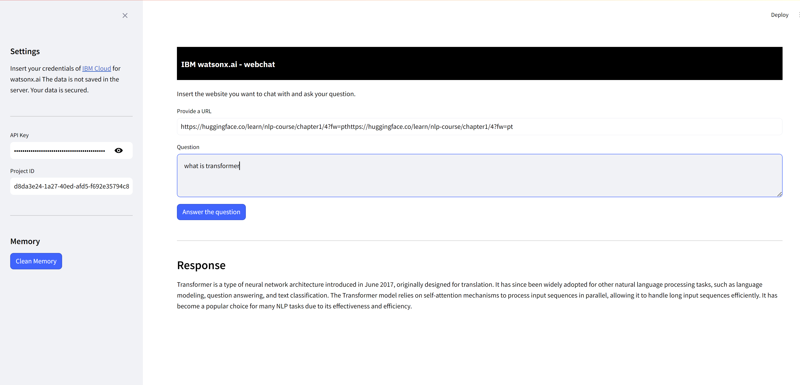

# WatsonX-WebChat

WatsonX-WebChat is a user-friendly web app that lets you chat with a web page! Just provide a URL, and it uses IBM Watson's language models to answer your questions based on the page's content. It combines smart retrieval techniques with AI for accurate and relevant answers.

## Features

- Extracts and processes text from a given URL.
- Embeds the text and stores it in a database.
- Answers user questions based on the embedded content using IBM Watson's language models.
- Interactive web interface built with Streamlit.

## Setup and Deployment

### Prerequisites

- WatsonX IBM
- Docker (optional)
### Installation

1. **Clone the repository:**

    ```sh
    git clone https://github.com/Abd-al-RahmanH/Chat-with-URL.git
    cd Chat-with-URL
    ```

2. **Create a `.env` file with your IBM Cloud credentials:**

    ```plaintext
    API_KEY=your_ibm_cloud_api_key
    PROJECT_ID=your_ibm_cloud_project_id
    ```
  
## To Run

```sh
pip install -r requirments.txt
```

```sh
streamlit run app.py
```

 
### Usage

1. **Access the application:**

    Open your browser and go to the URL provided by Hugging Face after deploying the application.

2. **Enter the required information:**

    - **API Key**: Your IBM Cloud API key.
    - **Project ID**: Your IBM Cloud project ID.
    - **URL**: The URL of the webpage you want to extract content 
    - **Question**: The question you want to ask based on the webpage content.

3. **Get the response:**

    Click the "Answer the question" button to get a response from the application.

## Contributing

Feel free to open issues or submit pull requests if you find any bugs or have suggestions for new features.

## License

This project is licensed under the MIT License - see the [LICENSE](LICENSE) file for details.
